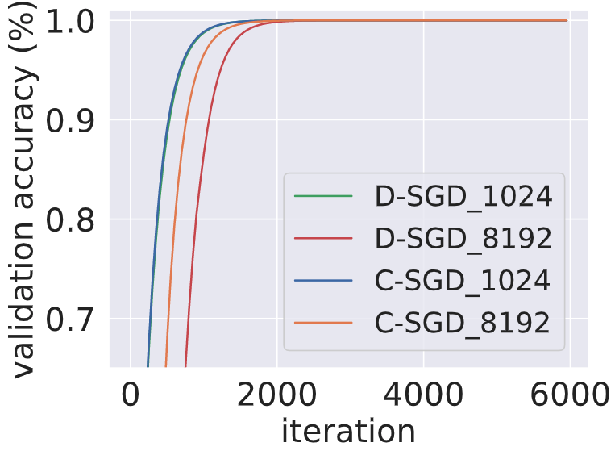
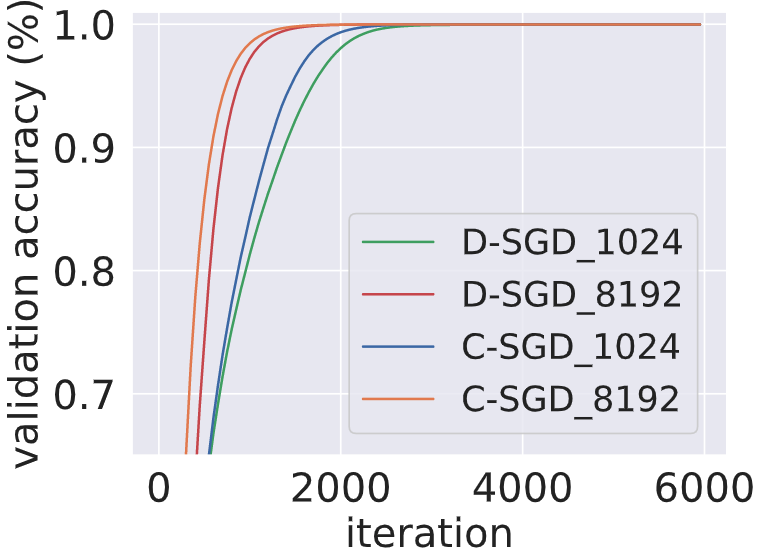

## Valid accuracy of ResNet-18 on CIFAR-10 with LAMB optimizer. The learning rates are set as 0.01(bs=8192) and 0.0035(bs=1024) respectively.

## Valid accuracy of ResNet-18 on CIFAR-10 with LAMB optimizer. The learning rates are set as 0.02(bs=8192) and 0.007(bs=1024) respectively.

## Training accuracy of ResNet-18 on CIFAR-10 dataset.

## Training accuracy of ResNet-18 on Tiny ImageNet dataset.

