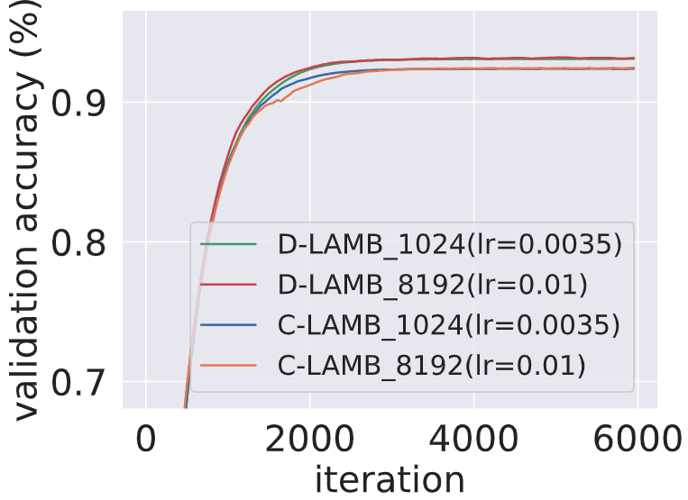

# 1. Validation accuracy comparisons for ResNet-18 on CIFAR-10 using centralized and decentralized LAMB with batch sizes of 1024 and 8192.
## 1.1 The learning rates are set as 0.01(bs=8192) and 0.0035(bs=1024) respectively.

## 1.2 The learning rates are set as 0.02(bs=8192) and 0.007(bs=1024) respectively.

# 2. Training accuracy of ResNet-18 on CIFAR-10 dataset.

# 3. Training accuracy of ResNet-18 on Tiny ImageNet dataset.

